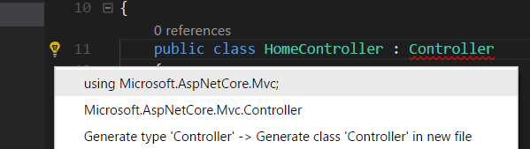

## 创建一个 ASP.NET Core 项目

如果你还在 Hello World 示例的那个目录里，请退回到 我的文档 或者 home 目录：

```shell
cd ..
```

接下来，创建一个新目录以保存你的整个项目，然后进到该目录里：

```shell
mkdir AspNetCoreTodo
cd AspNetCoreTodo
```

接下来，使用 `dotnet new` 创建一个新项目，这一次添加几个选项：

```shell
dotnet new mvc --auth Individual -o AspNetCoreTodo
cd AspNetCoreTodo
```

这个命令，使用 `mvc` 模板创建了一个新的项目，并添加了一些额外的验证和安全性相关的内容。（我会在 *安全性与身份* 一章讲解安全性的内容。）

> 你可能有点疑惑，为什么在一个 `AspNetCoreTodo` 目录里弄另一个 `AspNetCoreTodo` 目录。这个顶层或者说“根”目录可以容纳一个或多个项目目录。根目录有时候被称为 **解决方案目录**。后面，你将会在 `AspNetCoreTodo` 项目目录边上添加多个项目目录，它们全都在一个单一的根解决方案目录里。

你会在这个新的项目目录里出现了几个文件。在你 `cd` 到新目录里之后，就只需要运行这个项目了：

```shell
dotnet run

Now listening on: http://localhost:5000
Application started. Press Ctrl+C to shut down.
```

这个程序不再打印到控制台后直接退出，而是启动了一个 web 服务器，并在端口 5000 上等待访问请求。

开启你的网络浏览器，浏览 `http://localhost:5000`。你将看到 ASP.NET Core 程序的默认欢迎页面，说明你的程序工作正常！看够了这个页面之后，在终端窗口内按下 Ctrl-C 以便停止这个服务器。

### 一个 ASP.NET Core 项目的各部分

`dotnet new mvc` 模板为你生成了多个文件和目录。在默认创建的基本内容里，这几个是最重要的：

* **Program.cs** 和 **Startup.cs** 文件，设置 web 服务器和 ASP.NET Core 的处理管线。在 **Startup** 类里，你可以添加中间件，它们用于 处理和调整传入的请求、提供静态内容和错误页面。在这里，你还可以向依赖注入容器中添加你自己的服务（后面细说）。

* **Models**、**Views**，和 **Controllers**目录里放置着 模型-视图-控制器（MVC，Model-View-Controller）架构的组件。下一章，你将一探他们三者的究竟。

* **wwwroot** 目录里放着 CSS、JavaScript、图片文件 这些静态资源。`wwwroot` 里的文件将作为静态内容，将会自动被打包和压缩。

* **appsettings.json** 文件里包含着 ASP.NET Core 启动时读取的配置信息。你可以用它来保存数据库连接字符串或者其它你不想硬编码的任何内容。

### Visual Studio Code 技巧

如果你是初次使用 Visual Studio Code（或者 Visual Studio），下面这几个有益的小技巧将帮你轻松上手：

* **打开项目的根文件夹** ： 在 Visual Studio Code 里，选择 文件 -> 打开文件夹。打开 `AspNetCoreTodo` 文件夹（根目录），不是内层的项目目录。如果 Visual Studio Code 提示你安装缺失的文件，点击“是”以添加它们。

* **用 F5 运行（并调试断点）**：使你的项目处于打开状态，按下 F5 以调试模式运行项目。这跟命令行的 `dotnet run` 功能相同，但有一个额外好处——你可以在代码编辑器的左边栏上点击，以设置一个断点：

    

* **潜在问题的小灯泡提示**：如果你的代码里有红色波浪线（编译错误），把编辑的光标放在红线里，到左边栏里找那个小灯泡的图标，小灯泡的提示信息会给出常见问题的修改建议，比如在代码里添加一个 `using` 语句：

    

* **随手编译**：使用快捷键 `Command-Shift-B` 或者 `Control-Shift-B` 运行编译任务，这跟 `dotnet build` 的效果一样。

> 这些也可以用在 Widnows 版的 Visual Studio (不带 Code)。如果你用的是 Visual Studio，你需要直接打开 `.csproj` 项目文件所在的目录。 Visual Studio 后面会提示你保存解决方案文件，你应该把它保存在根目录（第一个 `AspNetCoreTodo` 文件夹）。你也可以在 Visual Studio 里使用模板直接创建 ASP.NET Core 项目，操作是 文件 > 新建 > 项目。

### Git 小贴士：

如果你使用 Git 或者 GitHub 管理你的源码，眼下就是一个适合的时机，在项目目录下用 `git init` 来初始化你的 Git 仓库：

```shell
cd ..
git init
```

请确保你添加了一个 `.gitignore` 文件用以忽略 `bin` 和 `obj` 这些目录。 GitHub 上 gitignore 模板仓库（https://github.com/github/gitignore）里的 Visual Studio gitignore 模板就很好用。

还有很多值得研究的内容，让我们着手构建这个应用吧！

---

## Create an ASP.NET Core project
If you're still in the directory you created for the Hello World sample, move back up to your Documents or home directory:

```
cd ..
```

Next, create a new directory to store your entire project, and move into it:

```
mkdir AspNetCoreTodo
cd AspNetCoreTodo
```

Next, create a new project with `dotnet new`, this time with some extra options:

```
dotnet new mvc --auth Individual -o AspNetCoreTodo
cd AspNetCoreTodo
```

This creates a new project from the `mvc` template, and adds some additional authentication and security bits to the project. (I'll cover security in the *Security and identity* chapter.)

> You might be wondering why you have a directory called `AspNetCoreTodo` inside another directory called `AspNetCoreTodo`. The top-level or "root" directory can contain one or more project directories. The root directory is sometimes called a **solution directory**. Later, you'll add more project directories side-by-side with the `AspNetCoreTodo` project directory, all within a single root solution directory.

You'll see quite a few files show up in the new project directory. Once you `cd` into the new directory, all you have to do is run the project:

```
dotnet run

Now listening on: http://localhost:5000
Application started. Press Ctrl+C to shut down.
```

Instead of printing to the console and exiting, this program starts a web server and waits for requests on port 5000.

Open your web browser and navigate to `http://localhost:5000`. You'll see the default ASP.NET Core splash page, which means your project is working! When you're done, press Ctrl-C in the terminal window to stop the server.

### The parts of an ASP.NET Core project
The `dotnet new mvc` template generates a number of files and directories for you. Here are the most important things you get out of the box:

* The **Program.cs** and **Startup.cs** files set up the web server and ASP.NET Core pipeline. The `Startup` class is where you can add middleware that handles and modifies incoming requests, and serves things like static content or error pages. It's also where you add your own services to the dependency injection container (more on this later).

* The **Models**, **Views**, and **Controllers** directories contain the components of the Model-View-Controller (MVC) architecture. You'll explore all three in the next chapter.

* The **wwwroot** directory contains static assets like CSS, JavaScript, and image files. Files in `wwwroot` will be served as static content, and can be bundled and minified automatically.

* The **appsettings.json** file contains configuration settings ASP.NET Core will load on startup. You can use this to store database connection strings or other things that you don't want to hard-code.

### Tips for Visual Studio Code

If you're using Visual Studio Code for the first time, here are a couple of helpful tips to get you started:

* **Open the project root folder**: In Visual Studio Code, choose File - Open or File - Open Folder. Open the `AspNetCoreTodo` folder (the root directory), not the inner project directory. If Visual Studio Code prompts you to install missing files, click Yes to add them.

* **F5 to run (and debug breakpoints)**: With your project open, press F5 to run the project in debug mode. This is the same as `dotnet run` on the command line, but you have the benefit of setting breakpoints in your code by clicking on the left margin:


* **Lightbulb to fix problems**: If your code contains red squiggles (compiler errors), put your cursor on the code that's red and look for the lightbulb icon on the left margin. The lightbulb menu will suggest common fixes, like adding a missing `using` statement to your code:


* **Compile quickly**: Use the shortcut `Command-Shift-B` or `Control-Shift-B` to run the Build task, which does the same thing as `dotnet build`.

> These tips apply to Visual Studio (not Code) on Windows too. If you're using Visual Studio, you'll need to open the `.csproj` project file directly. Visual Studio will later prompt you to save the Solution file, which you should save in the root directory (the first `AspNetCoreTodo` folder). You can also create an ASP.NET Core project directly within Visual Studio using the templates in File - New Project.

### A note about Git

If you use Git or GitHub to manage your source code, now is a good time to do `git init` and initialize a Git repository in the project root directory:

```
cd ..
git init
```

Make sure you add a `.gitignore` file that ignores the `bin` and `obj` directories. The Visual Studio template on GitHub's gitignore template repo (https://github.com/github/gitignore) works great.

There's plenty more to explore, so let's dive in and start building an application!
