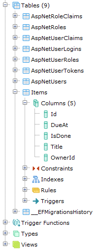

## Deploy to Heroku with PostgreSQL

Heroku is another platform you can use to easily and quickly deploy your ASP.NET Core application. The [Heroku CLI](https://devcenter.heroku.com/articles/heroku-cli) will be used for most of this process. Later, when your application is deployed, Heroku's web portal can be used to inspect your application's state and manage it, including for example changing its environment variables.

Heroku offers various levels of hosting services. Their "[dyno](https://devcenter.heroku.com/articles/dyno-types)"s refer to an instance of your application running. If you have multiple dynos provisioned, incoming HTTP requests will be load balanced. Their lowest level dyno type is the "free" dyno type. Therefore, following the steps here to deploy to Heroku will not incur any charges to your Heroku account.

Because of the way Heroku hosts your application, using an [ephemeral filesystem](https://devcenter.heroku.com/articles/dynos#ephemeral-filesystem), you cannot use SQLite for your application's database. Unfortunately, this means the default setup you used if you followed along coding as you read this book, and when you deployed to Azure, won't work. Instead, you'll use PostgreSQL as your database, and you'll use the free tier of the [Heroku Postgres](https://www.heroku.com/postgres) addon. This means that Heroku will provision you access to a shared PostgreSQL database and expose a connection string to your application so that it will know how to connect to the database.

Don't worry if the idea of using a different database seems scary. One of Entity Framework Core's strengths is that you can substitute providers for each other. Switching to PostgreSQL will be as simple as switching to the PostgreSQL Entity Framework Core provider, and the steps below will walk you through this process.

### What you'll need

* Git (use `git --version` to make sure it's installed)
* The Heroku CLI (follow the install instructions at https://devcenter.heroku.com/articles/heroku-cli#download-and-install)
* A Heroku account (accounts are free, and this tutorial will only use free tier services on Heroku)

### Set up Heroku CLI and create new Heroku app

After installing the Heroku CLI, use the `heroku login` command to log in.

After doing so, navigate to the `AspNetCoreTodo` directory on your computer (not the testing projects) and use the `heroku create little-aspnetcorebook-12345` command to create a new Heroku app with a unique name. Replace the `12345` with a unique string of characters so as to not cause a conflict with existing Heroku apps. For example, you might use your name for this value.

Heroku uses Git as a deployment tool. Now that you created the app, a remote Git repository was set up for you. You'll see this remote repository used later in the steps below to deploy your application.

Heroku uses "[buildpack](https://devcenter.heroku.com/articles/buildpacks)" to decide which steps to complete to prepare the dyno to run your app. They include setup processes such as downloading and installing SDKs (like `apt-get` on an Ubuntu server). Heroku officially supports multiple platforms such as Ruby on Rails and PHP. For those apps, your application's source code structure is enough for Heroku to decide which official buildpack to use. For ASP.NET Core, since it's not yet an official platform, the community is responsible for creating a buildpack for it and you must manually add this buildpack to your Heroku app. Luckily, [this buildpack](https://github.com/jincod/dotnetcore-buildpack) has been created by the open source community, and you can add it to your Heroku app with the following command:

```
heroku buildpacks:set https://github.com/jincod/dotnetcore-buildpack
```

Next, you'll modify your application's source code to switch to PostgreSQL.

### Add PostgreSQL provider NuGet package

The provider comes as a NuGet package called `Npgsql.EntityFrameworkCore.PostgreSQL`. To add the package, run the following command:

```
dotnet add package Npgsql.EntityFrameworkCore.PostgreSQL
```

After adding the package, you'll notice that the project's `.csproj` file has been updated to reflect the new list of packages:

```xml
<ItemGroup>
  <PackageReference Include="Humanizer" Version="2.2.0" /> <!-- Added earlier -->
  <PackageReference Include="Microsoft.AspNetCore.All" Version="2.0.3" />
  <PackageReference Include="Microsoft.EntityFrameworkCore.Tools" Version="2.0.1" PrivateAssets="All" />
  <PackageReference Include="Microsoft.VisualStudio.Web.CodeGeneration.Design" Version="2.0.1" PrivateAssets="All" />
  <PackageReference Include="Npgsql.EntityFrameworkCore.PostgreSQL" Version="2.0.1" /> <!-- Added now -->
</ItemGroup>
```

### Modify ApplicationDbContext configuration

Your project's `Startup.cs` file's `ConfigureServices` method currently contains the following code, which hooks up the SQLite provider:

```csharp
services.AddDbContext<ApplicationDbContext>(options =>
    options.UseSqlite(Configuration.GetConnectionString("DefaultConnection")));
```

Change it to the following code, which will instead hook up the PostgreSQL provider:

```csharp
services.AddEntityFrameworkNpgsql().AddDbContext<ApplicationDbContext>(options =>
    options.UseNpgsql(Configuration.GetConnectionString("DefaultConnection")));
```  

The connection string `DefaultConnection` will also have to be updated to reflect connecting to a different database. Right now, your project's `appsettings.json` file contains the following connection string for SQLite:

```
"ConnectionStrings": {
  "DefaultConnection": "DataSource=app.db"
}
```

Change it to the following code to provide a connection string for PostgreSQL:

```
"ConnectionStrings": {
  "DefaultConnection": "Server=localhost;Port=5432;User Id=username;Password=secret;Database=todos;"
}
```

The connection string is composed of four parameters:

- You use `localhost` for the `Server` parameter because you'll be running PostgreSQL on your development machine in this tutorial.
- You use `5432` for the `Port` parameter because this is the default port for PostgreSQL, which you won't be changing in this tutorial.
- You use `username` and `secret` for `User Id` and `Password` respectively, because these are simple example values this tutorial uses. In a real world deployment, you would use more secure credentials and tools like the [Secret Manager](https://docs.microsoft.com/en-us/aspnet/core/security/app-secrets?view=aspnetcore-2.1&tabs=visual-studio) to store them.

### Starting a PostgreSQL database

Setting up PostgreSQL on your development machine is outside of the scope of this book. You can install and start PostgreSQL any way you like. However, a convenient, modern way of doing this is using [Docker](https://www.docker.com/). If you've used virtual machines before, Docker "containers" are a similar concept. Think virtualization but without a hypervisor. The containers get direct access to the kernel of the host machine.

With [Docker installed](https://docs.docker.com/install/) on your machine, you can create and run a container from the [`Postgres`](https://hub.docker.com/_/postgres/) image. You will use the same parameters from the connection string defined above to create the container, using the following command:

```
docker run -d -e POSTGRES_USER=username -e POSTGRES_PASSWORD=secret -e POSTGRES_DB=todos -p 5432:5432 --name postgres-todos postgres:latest
```

After creating and starting the container (which is what the `docker run` command does), the container is running in the background and exposing port `5432` so that the running ASP.NET Core application and tools like [pgAdmin](https://www.pgadmin.org/) can connect to it at `localhost`.

### Updating the database with migrations

Now that PostgreSQL is running in the background, you can update the database with the same command you used earlier in the tutorial when working with SQLite:

```
dotnet ef database update
```

The reason you must run the migrations again is because this time the connection string defined for the app points to a different database. This new database does not yet have the needed tables created. Running the migrations again at this point in the tutorial prepares the running PostgreSQL database the same way it prepared the SQLite database earlier.

Now that the migrations have been applied, you can use a program like pgAdmin to connect to the database and see the tables that were created:



Start your app with `dotnet run` and visit `localhost:5000` in your browser. You'll notice that you can create and manipulate `Todo` items just like before, except this time the data is being saved in the PostgreSQL database. Notice how everything works just like it did before without having to change any code except load a different Entity Framework Core provider in `Startup.cs`.

### Preparing the application for Heroku Postgres

Right now, your application reads the value of the `DefaultConnection` configuration value at runtime to learn how to connect to the PostgreSQL database running on your development machine. On Heroku, the environment will be different. Heroku sets an environment variable called `DATABASE_URL` for your application to read. You must change your code to read this environment variable instead of the configuration if it detects that it is running on Heroku. In order to tell your application that it's running on Heroku, you'll configure it to read a the environment variable `ASPNETCORE_ENVIRONMENT`. This environment variable has been set to the value `Development` for you automatically by Visual Studio Code so far. You can configure your application to run in "Heroku mode" if this environment variable's value is set to `Production`. Change the following code in `Startup.cs`:

```csharp
services.AddEntityFrameworkNpgsql().AddDbContext<ApplicationDbContext>(options =>
    options.UseNpgsql(Configuration.GetConnectionString("DefaultConnection")));
```

to this:

```csharp
services.AddEntityFrameworkNpgsql().AddDbContext<ApplicationDbContext>(options =>
{
    var env = Environment.GetEnvironmentVariable("ASPNETCORE_ENVIRONMENT");

    string connStr;

    // Depending on if in development or production, use either Heroku-provided
    // connection string, or development connection string from env var.
    if (env == "Development")
    {
        // Use connection string from file.
        connStr = Configuration.GetConnectionString("ApplicationDbContext");
    }
    else
    {
        // Use connection string provided at runtime by Heroku.
        var connUrl = Environment.GetEnvironmentVariable("DATABASE_URL");

        // Parse connection URL to connection string for Npgsql
        connUrl = connUrl.Replace("postgres://", string.Empty);
        var pgUserPass = connUrl.Split("@")[0];
        var pgHostPortDb = connUrl.Split("@")[1];
        var pgHostPort = pgHostPortDb.Split("/")[0];
        var pgDb = pgHostPortDb.Split("/")[1];
        var pgUser = pgUserPass.Split(":")[0];
        var pgPass = pgUserPass.Split(":")[1];
        var pgHost = pgHostPort.Split(":")[0];
        var pgPort = pgHostPort.Split(":")[1];

        connStr = $"Server={pgHost};Port={pgPort};User Id={pgUser};Password={pgPass};Database={pgDb}";
    }

    // Whether the connection string came from the local development configuration file
    // or from the environment variable from Heroku, use it to set up your DbContext.
    options.UseNpgsql(connStr);
});
```

It's a lot more code, but it's a powerful change. This will allow your app to decide as it starts up whether it's running on your local development computer or deployed in production mode on Heroku, and connect to the database meant for it properly in both cases.

Don't mind the code related to parsing the "connection URL". Some platforms, such as Ruby on Rails, can use this value as is. Unfortunately, you must do a bit of extra work to convert it into a value compatible with Entity Framework Core. Feel free to refactor this parsing code into a utility class elsewhere in your application later if you want to.

**Before continuing**, you must make sure the `ASPNETCORE_ENVIRONMENT` environment variable is set to `Production` so that your application will correctly connect to the database once it's deployed. You can use Heroku's web portal to do this, but to continue with the CLI theme of the book, use the Heroku CLI to do this instead with the `heroku config:set ASPNETCORE_ENVIRONMENT=Production` command.

### Set up automatic Entity Framework Core migrations on Heroku

When your application is deployed to Heroku, you won't have a way to run migrations against it like you did on your local development computer. Instead, you'll change your application's source code to automatically obtain an `ApplicationDbContext` instance when it detects that it is starting up on Heroku, and use that instance to run any pending migrations before the application finishes starting up.

You'll be exposed to a new C# concept here, called "extension methods". Because the best place to run this code will be in `Program.cs` (because it isn't safe to run it in `Startup.cs`), you will add an extension method to the `IWebHost` interface that you will call as part of the method chain in your application's `Main` method body. Create a file called `Extensions.cs` and add the following code to it:

```csharp
public static class Extensions
{
    public static IWebHost MigrateDatabase(this IWebHost webHost)
    {
        // Manually run any pending migrations if configured to do so.
        var env = Environment.GetEnvironmentVariable("ASPNETCORE_ENVIRONMENT");

        if (env == "Production")
        {
            var serviceScopeFactory = (IServiceScopeFactory)webHost.Services.GetService(typeof(IServiceScopeFactory));

            using (var scope = serviceScopeFactory.CreateScope())
            {
                var services = scope.ServiceProvider;
                var dbContext = services.GetRequiredService<ApplicationDbContext>();

                dbContext.Database.Migrate();
            }
        }

        return webHost;
    }
}
```

The static method in this class adds a method to the `IWebHost` interface that has no parameters. The `this IWebHost webHost` parameter is what allows the method to be added to the `IWebHost` interface as an extension method.

The code inside will first check whether the application is running in Production, and therefore running on Heroku. If so, it will obtain a temporary DI scope inside which it will obtain an `ApplicationDbContext` instance and perform the pending migrations. Then, the application will continue to start up.

Then, change your code in `Program.cs` from:

```csharp
public static void Main(string[] args)
{
    BuildWebHost(args).Run();
}
```

to

```csharp
public static void Main(string[] args)
{
    BuildWebHost(args)
        .MigrateDatabase()
        .Run();
}

```

This will call your new extension method as the application starts up.

### Deploy to Heroku

To deploy your application to Heroku, use `git add` and `git commit` to check in your code changes, and run the `git push heroku master` command. You'll see output in your terminal as Heroku goes through its build process. At the end of this process, your application's public URL will be deployed. You can visit this in your web browser to see your deployed app!

If you change your application's models or add new models, you can add migrations with the `dotnet ef migrations add` command like before. You can run the migrations locally with the `dotnet ef database update` command like before, and when you deploy your application again, those migrations will run automatically to bring the Heroku Postgres database up to date.

Keep in mind that once your app is running with live data it isn't typical to automatically run migrations. Instead, you would use [more careful techniques](https://docs.microsoft.com/en-us/ef/core/managing-schemas/migrations/#applying-migrations-at-runtime) that usually include using the Entity Framework Core CLI tools to create scripts.
