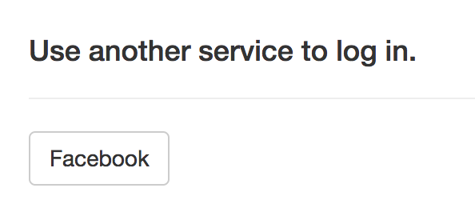

## 添加 Facebook 登录功能

Individual Auth 项目模板包括了“开箱即用”式的“使用电子邮件地址和密码注册”的功能。你可以添加额外的身份供应者（比如 Google 和 Facebook）来扩展这个功能。

要接入任何一个身份供应商，你通常需要做这两件事：

1. 在供应商那里创建一个 应用（有时候也叫*客户(client)*），以此代表你的程序
1. 复制供应商生成的 ID 和 密码，放进你的代码里

### 在 Facebook 创建一个应用

你可以使用位于 https://developers.facebook.com/apps 的 Facebook 开发者控制台创建一个新的 Facebook 应用。点击 **Add a New App** 并按提示创建一个应用 ID。

> 提示：如果你没有 Facebook 账号，可以换成 Google 或者 Twitter 登录功能。在供应商网站上的操作会有些差异，但在代码里基本一致。

下一步，设置 Facebook Login 然后点击左边栏的 Settings —— 在 Facebook Login 下面：


把以下 URL 添加到 **Valid OAuth redirect URIs** 文本框里。

```
http://localhost:5000/signin-facebook
```

点击 **Save Changes**，然后打开 Dashboard 页面。在这里你可以看到由 Facebook 创建的 应用ID 和 密码，这些稍后就会用到（请保持这个页面开启）。

要在 ASP.NET Core Identity 里启用 Facebook 登录功能，把下面这段代码添加到 `Startup` 类里 `ConfigureServices` 方法中的任意位置：

```csharp
services
    .AddAuthentication()
    .AddFacebook(options =>
    {
        options.AppId = Configuration["Facebook:AppId"];
        options.AppSecret = Configuration["Facebook:AppSecret"];
    });
```

为免把 Facebook 应用ID 和 密码 硬编码在程序里，这些值应该从配置系统里获取。一般情况下 `appsettings.json` 文件是保存项目配置信息的地方。尽管如此，既然它会被提交到版本控制系统里，就不太适合 应用ID 和 密码 这些敏感信息。（比方说，你的密码推送到了 GitHub，任何人都可能窃取它，并滥用它来损害你的利益。）

### 通过 Secrets Manager 来安全地保存密码

你可以把 Secrets Manager 工具用于 应用密码 这种敏感信息。在终端窗口里执行这一行以确保它安装过了（先确保你当前位于项目目录中）：

```
dotnet user-secrets --help
```

从 Facebook 应用管理页面复制 应用ID 和 密码，并使用 `set` 命令将它们的值保存在 Secrets Manager 里：

```
dotnet user-secrets set Facebook:AppId <粘贴 应用ID>
dotnet user-secrets set Facebook:AppSecret <粘贴 应用密码>
```

当你的程序启动的时候，Secrets Manager 里的值会加载到 `Configuration` 属性中，所以你刚才在 `ConfigureServices` 中添加的代码能够访问到它们。

运行程序，在导航条上点击 Login，你会看到一个新的按钮，用于 Facebook 登录功能：



试一下 Facebook 登录功能。你会被重定向到 Facebook 并被提示向你的应用授权，然后重定向回来再登录进去。

---

## Add Facebook login

Out of the box, the Individual Auth template includes functionality for registering using an email and password. You can extend this by plugging in additional identity providers like Google and Facebook.

For any external provider, you typically need to do two things:

1. Create an app (sometimes called a *client*) on the external provider that represents your application
1. Copy the ID and secret generated by the provider and put them in your code

### Create an app in Facebook

You can create new Facebook apps using the Facebook Developer console at https://developers.facebook.com/apps. Click **Add a New App** and follow the instructions to create an app ID.

> Sidebar: If you don't have a Facebook account, you can set up Google or Twitter login instead. The steps on the provider's site will be different, but the code is almost identical.

Next, set up Facebook Login and then click Settings on the left side, under Facebook Login:


Add the following URL to the **Valid OAuth redirect URIs** box:

```
http://localhost:5000/signin-facebook
```

Click **Save Changes** and then head over to the Dashboard page. Here you can see the app ID and secret generated by Facebook, which you'll need in a moment (keep this tab open).

To enable Facebook login in ASP.NET Core Identity, add this code anywhere in the `ConfigureServices` method in the `Startup` class:

```csharp
services
    .AddAuthentication()
    .AddFacebook(options =>
    {
        options.AppId = Configuration["Facebook:AppId"];
        options.AppSecret = Configuration["Facebook:AppSecret"];
    });
```

Instead of hardcoding the Facebook app ID and secret in your code, the values are pulled from the configuration system. The `appsettings.json` file is normally the place to store configuration data for your project. However, since it's checked into source control, it's not good for sensitive data like an app secret. (If your app secret was pushed to GitHub, for example, anyone could steal it and do bad things on your behalf.)

### Store secrets safely with the Secrets Manager

You can use the Secrets Manager tool for sensitive data like an app secret. Run this line in the terminal to make sure it's installed (make sure you're currently in the project directory):

```
dotnet user-secrets --help
```

Copy the app ID and secret from the Facebook app dashboard and use the `set` command to save the values in the Secrets Manager:

```
dotnet user-secrets set Facebook:AppId <paste app id>
dotnet user-secrets set Facebook:AppSecret <paste app secret>
```

The values from the Secrets Manager are loaded into the `Configuration` property when your application starts up, so they're available to the code in `ConfigureServices` you added before.

Run your application and click the Login link in the navbar. You'll see a new button for logging in with Facebook:


Try logging in with Facebook. You'll be redirected and prompted to give your app permission in Facebook, then redirected back and logged in.
